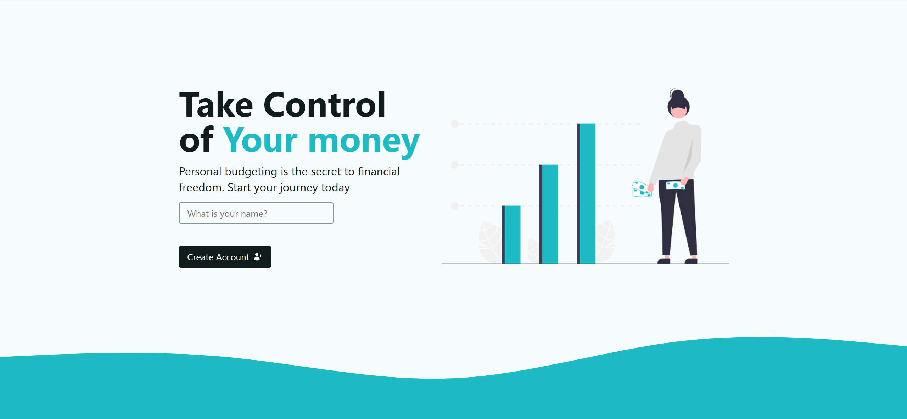
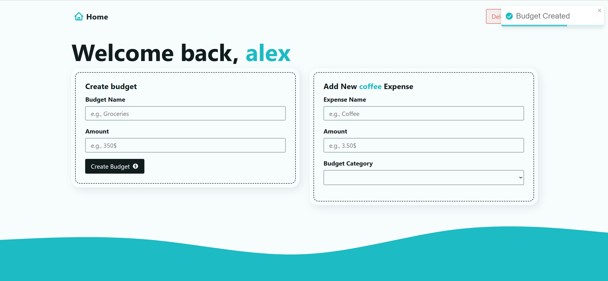

# 📘 Finance App (In Progress)

## 🚀 Используемые технологии


## 📌 Описание
- Приложение для учета личных финансов с хранением данных в браузере:

- Ввод и разбиение по категориям доходов/расходов.

- Визуализация статистики.

- Работа без сервера, с применение LocalStorage.

- Планируется переход на TypeScript

---



## ⚙️ Установка и запуск проекта

1. Склонируйте проект:
   ```bash
   git clone https://github.com/Alexander-Klem/financeApp-inProcess.git 
   ```
2. Установите зависимости:
   ```bash
   npm install
   ```
3. Запустите приложение:
    ```bash
   npm start
   ```
4. Откройте в браузере:
    ```bash
    http://localhost:3000
    ```


